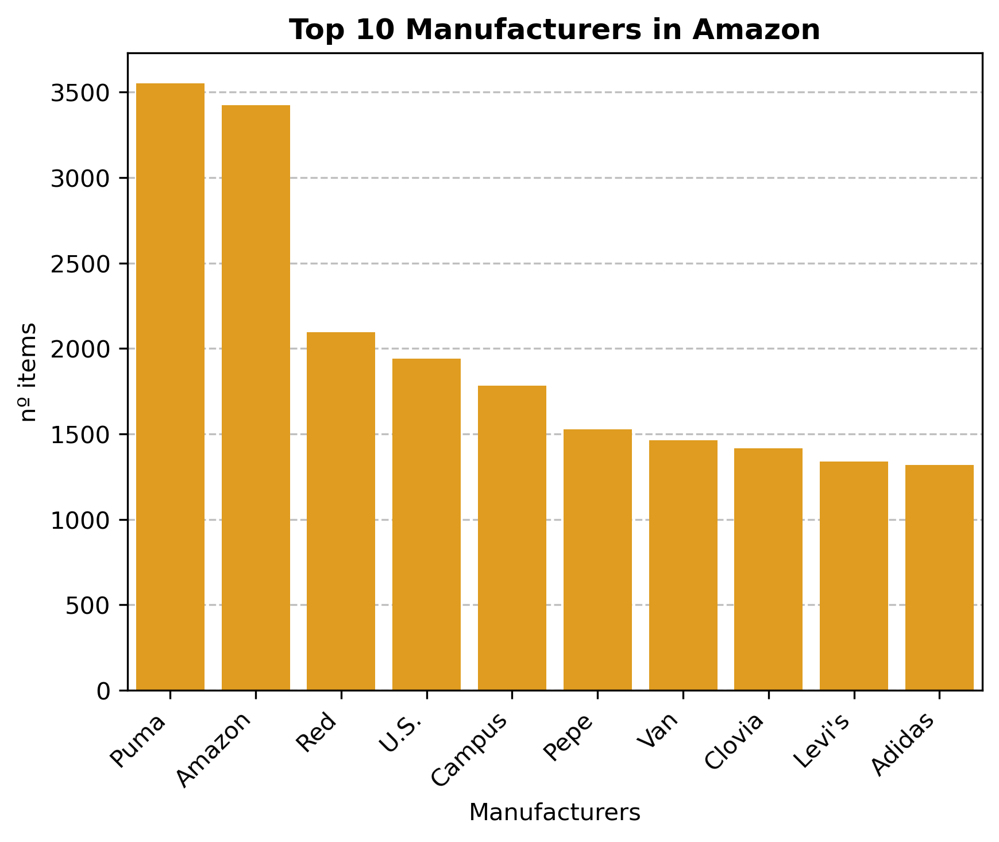

# Exploratory Data Analysis in Amazon datasets
---
### Contributors

- Juan F. García-Moreno

---
### Objective

The purpose of this repository is to conduct an Exploratory Data Analysis of product data from Amazon. By leveraging statistical techniques, data visualization, and advanced data analysis methods, we strive to uncover valuable insights and patterns within the dataset.

---
### Project Structure

- amazon_data_files: This directory contains the Amazon datasets.
- notebooks: This directory contains Jupyter notebooks with the exploratory data analysis code.

---
### Data Visualization

Here is the bar plot displaying Top10 most popular manufacturers:

