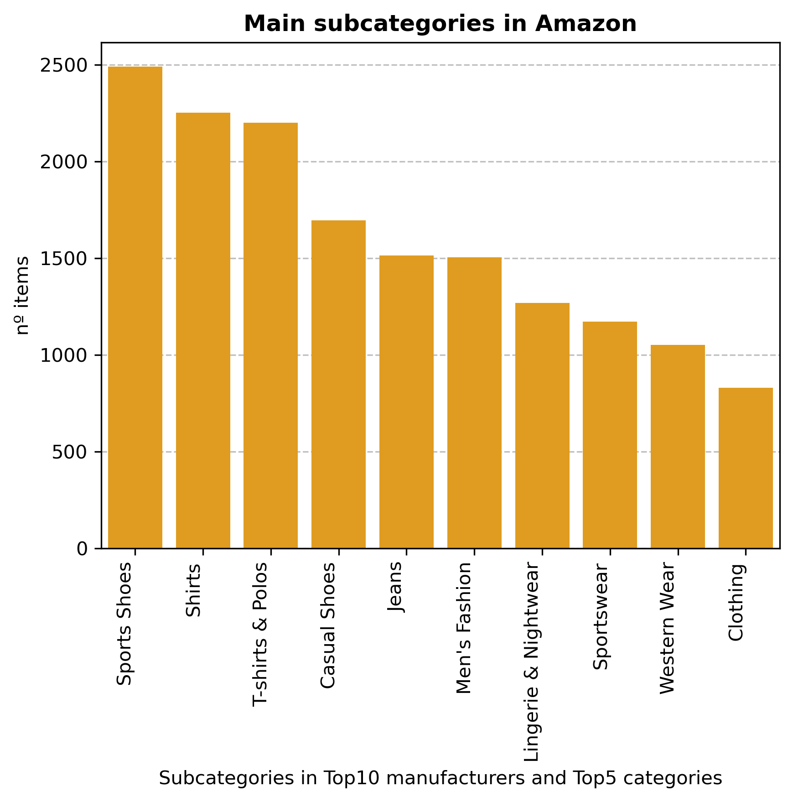
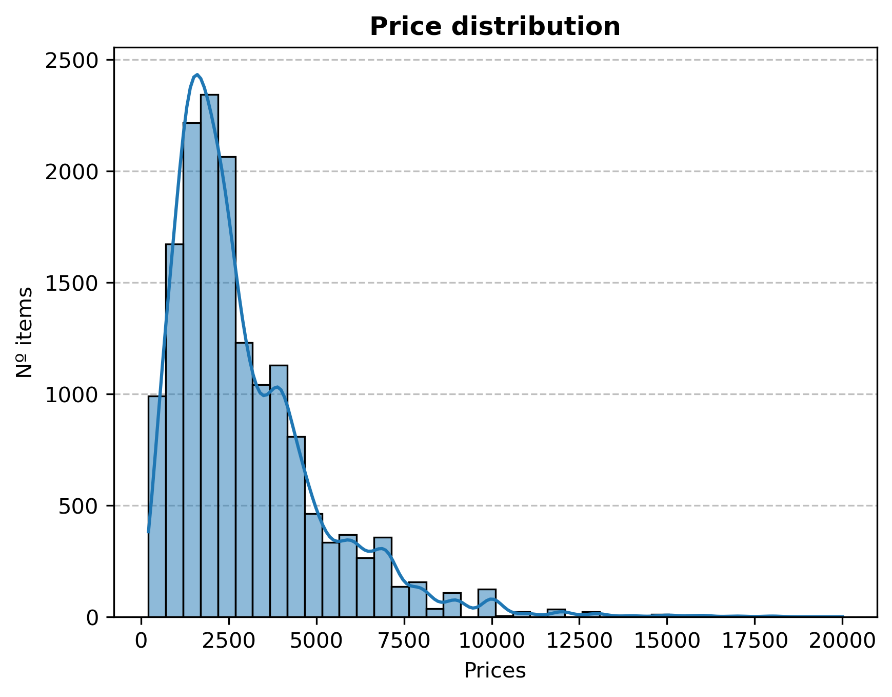

# Exploratory Data Analysis in Amazon datasets
---
### Contributors

- Juan F. García-Moreno

---
### Objective

The purpose of this repository is to conduct an Exploratory Data Analysis of product data from Amazon. By leveraging statistical techniques, data visualization, and advanced data analytics methods, we strive to uncover valuable insights and patterns within the dataset.

---
### Project Structure
#### 1. Extract data
. Uses of Amazon API
- amazon_data_files: This directory contains the Amazon datasets.
#### 2. Data transformation and EDA
- notebooks: This directory contains Jupyter notebooks with the exploratory data analysis code.
- images: This directory stores images generated during the EDA.

---
### Data Visualization

After carefully performing data wrangling, we proceeded to visualize product data through diverse types of plots to understand trends and patters. Here is a bar plot displaying the Top10 most popular manufacturers:

  

The plot shows the number of items among the top manufacturers. According to the above visualization, Puma is the most popular brand.

In the next image, the most popular categories in the Top10 manufacturers are shown.

  

The plot shows the number of items among categories. The most popular category in Top10 manufacturers is men's clothing.

Next, we analyzed the main subcategories in Amazon within the top10 manufacturers considering the top5 categories.

  

The plot shows the number of items among subcategories. The most popular subcategory is Sports Shoes, followed by Shirts and T-shirts & Polos.

In the following graph, price distribution is displayed across the Top10 manufacturers, and considering Top5 categories and Top10 subcategories.

  

The histogram reveals that the majority of products are sold in the price range of approximately `10` to `4000`. However, there's a long tail on the right side, indicating that there are products sold at much higher prices. The Kernel Density Estimate (the smooth line) also shows the right-skewed nature of the data distribution.

Then, we analyzed the presence of outliers regarding product prices.

  

The pie chart shows that around 3.5% of product data within the Top10 manufacturers are outliers.

Finally, a violin plot was created to understand how price is distributed across the top10 manufacturers.

  

---
### Conclusions:
1) The most popular brand is Puma.
2) The most popular category in Top10 manufacturers is 'men's clothing'.
3) The most popular subcategory is 'Sports Shoes' followed by 'Shirts and T-shirt's & 'Polos'.
4) The products with price less than ₹4000 are more popular.
5) Around 3.5% of product data within the Top10 manufacturers are outliers.
6) Puma, Red, Adidas and Levi's display a wide range of prices. Puma and Levi's have a thicker section around the median, suggesting that most products in these brands fall within this price range.
7) Campus, US and Amazon have a more condensed price distribution, displaying a majority of products priced in the lower to mid-range.
8) Van, Clovia and Pepe have a bimodal distribution, indicating two major groups of product prices.

